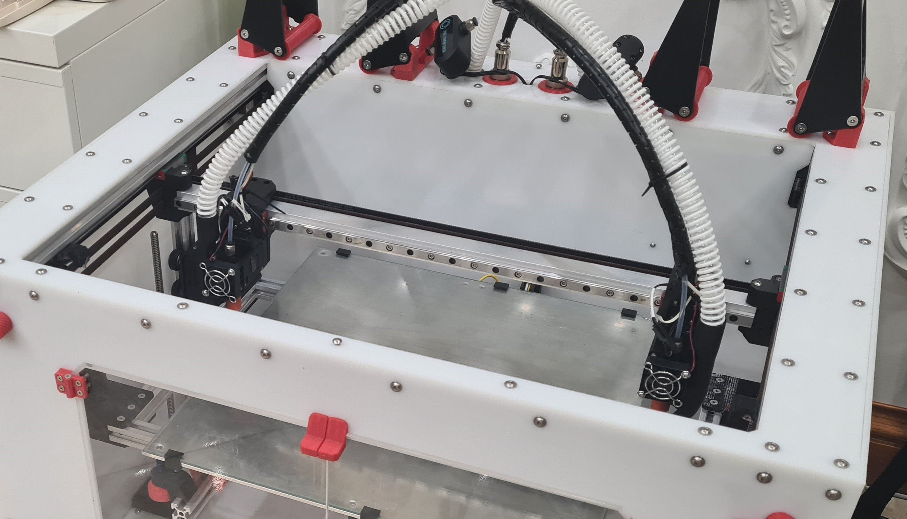
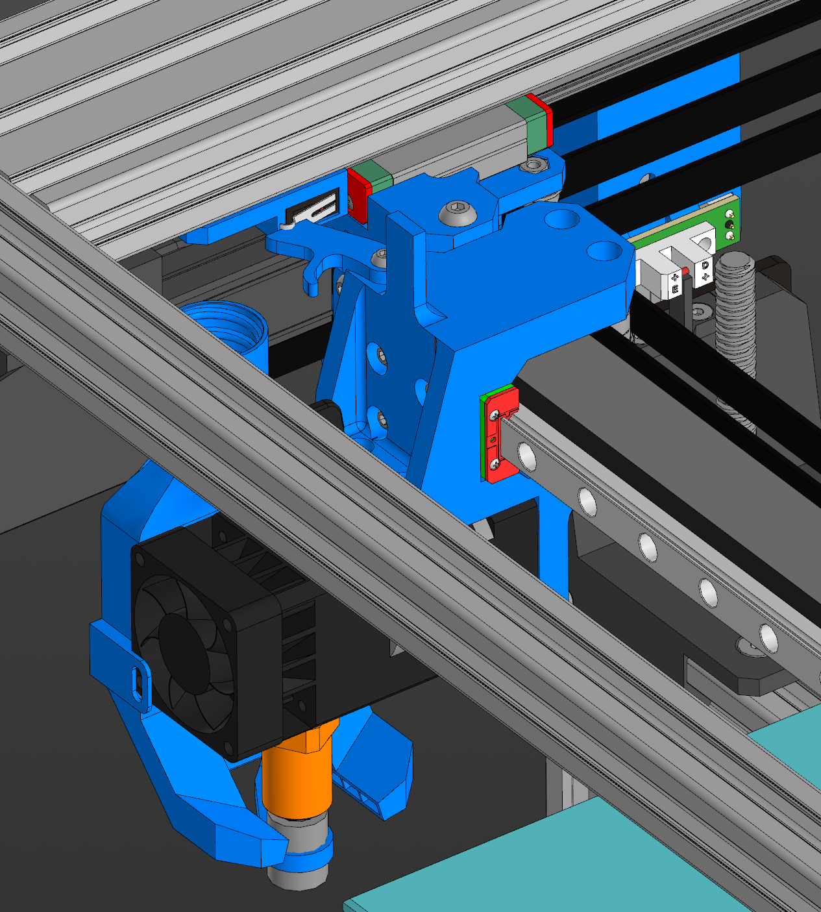

# K3D Vostok Biqu H2 mod

Мод для Востока под установку голов с экструдерами Biqu H2, а также балкой оси X из алюминиевого квадратного профиля. Обдув двумя 5015 вентиляторомаи или удалённый обдув под CPAP трубку 15 мм. Очистители сопел для двухэкструдерной печати.

### Плюсы
* Biqu H2 (возможность печатать очень мягкими TPU)
* Жёсткая балка из квадратного профиля
* Обдув 2х5015 или CPAP (Обдувы адаптированы для Volcano и CHC Pro, (v6 не тестировался))
* Очистители сопел

### Минусы
* Потеря около 35 мм области печати по Z
* Дороговизна H2

### Отличия от стока:
* Маунты голов (есть версия для MGN12H)
* Каретки Y:
  * Увеличена жёсткость
  * Прижим ремня передалан на алюминиевый
  * Крепление под квадратную балку X
* Маунты механических концевиков X и Y
* Маунты оптических концевиков Z
* Очистители сопел из силиконовых трубок (исключёно случайное прилипание выдавившегося для очистки пластика)

## Содержание репозитория:
* Сборка в формате .step
* Файлы для печати в формате .stl
* BOM (список необходимых деталей)
* [Указания](instructions/Printing%20recommendations.pdf) по ориентации деталей при печати и ручным поддержкам
* ~~Инструкция по сборке~~ (может быть когда-нибудь)

## 3D Сборка
* Модифицированные или новые детали в сборке выделены синим цветом
* Наименовавния новых деталей имеют вид M<версия мода>-<номера сборок и деталей>. В скобках указана стоковая заменённая деталь
* По умолчанию в модели показаны оба варианта обдувов, они накладываются друг на друга. Это не ошибка. В списке компонентов нужно скрыть неподходящий вариант

## Файлы для печати
Используйте те же рекомендации и настройки, что и в стоковом BOM. Во втором столбце указаны детали из стока, которые заменены новыми. Другие комментарии и количество деталей представлены в BOM

## BOM
Файл ods следует открывать в Libre Office (предпочтительно) или Google таблицах

## ~~Инструкция~~

# Благодарности
* Проект Восток (https://k3d.tech/vostok)
* Дмитрий Соркин (https://t.me/dsorkin) - автор проекта Восток, модель biqu h2 ([grabcad](https://grabcad.com/library/biqu-h2-dimensional-model-1))
* Юрий Кривенко (https://t.me/popingus) - основа маунтов балки и голов, модели обдувов
* .//Hack (https://t.me/DssHack) - маунты голов для MGN12H
* Alex Troiden - модель CHC Pro ([grabcad](https://grabcad.com/library/chc-pro-trianglelab-1))

